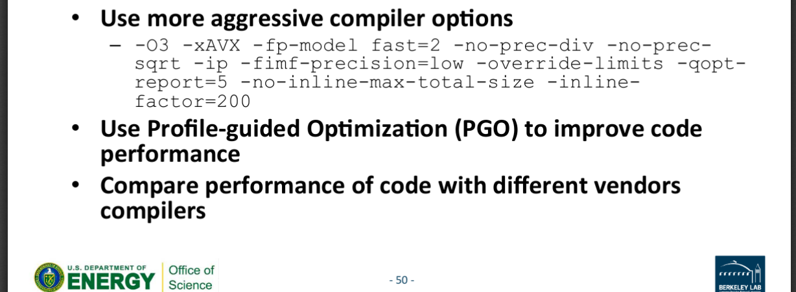

# 用于收集编译器相关的经验
这个文件夹下的其他pdf包含了精度控制（可以通过降精度来加速，但是可能造成收敛速度变慢，反而减速），向量化（一般都是读输出的信息，对没有充分向量化的地方进行分析和修改，浙大的前辈 ASC16 手写过orz），
# intel
 一个典型的样例(CESM)


如果需要手写 Intrinsics
https://software.intel.com/sites/landingpage/IntrinsicsGuide/#

MKL的链接

https://software.intel.com/en-us/articles/intel-mkl-link-line-advisor/ (有人说用这个不好？)


### static link for icc/ifort
As per the documentation, while -static-intel is the default, compiling with -dynamic links in the Intel dynamic libraries when creating the shared library. I confirmed that and also confirmed when adding -static-intel that it links in the Intel static libraries when creating the shared library. You can verify the Intel static libraries are linked in by adding -# and inspecting the actual ld command line, or use ldd.
https://software.intel.com/zh-cn/node/297975


intel 全家桶的参数列举（以后的同学可以逐渐补全）


```
-ipo
‐align array64byte 这个可以让array按照64位对齐，考虑到是64位浮点数，这样方便访存
-fprotect-parens 指定了括号的地方，不做数学上计算顺序的优化
-fimf-precision=high 控制mkl（svml）的精度到high （.aka.最后一位bit可能不准确）
-fp-model double ... 按照double ... 精度来计算浮点数 
 -fp-model fast=1 浮点数相关的具体请看我在这个目录下放的一个pdf
-mveclibabi=svml -lsvml 尝试使用svml

-no-prec-div
https://software.intel.com/en-us/cpp-compiler-developer-guide-and-reference-prec-div-qprec-div


这个只在极端条件下会有用，一般用不到
Profile-Guided Optimization (PGO)

.. Instrument the program: build the program using the compiler flag -prof-gen or /Qprof-gen
.. Run the instrumented executable to gather profiling data with various input data or workloads
.. Re-build the program with the profiling data using flag -prof-use or /Qprof-use
https://software.intel.com/en-us/code-samples/intel-compiler/intel-compiler-features/ProfileGuidedOptimization
```
# gcc
-march=native

编译abi的问题，可以选择最新的，然后把abi降下来
```
https://askubuntu.com/questions/770358/how-should-i-handle-abi-incompatability-between-gcc-4-9-and-gcc-5/1179417#1179417
-fabi-version=n
           Use version n of the C++ ABI.  The default is version 0.

           Version 0 refers to the version conforming most closely to the C++ ABI specification.  Therefore, the ABI obtained using version 0 will change in different versions of G++ as ABI bugs are
           fixed.

           Version 1 is the version of the C++ ABI that first appeared in G++ 3.2.

           Version 2 is the version of the C++ ABI that first appeared in G++ 3.4, and was the default through G++ 4.9.

           Version 3 corrects an error in mangling a constant address as a template argument.

           Version 4, which first appeared in G++ 4.5, implements a standard mangling for vector types.

           Version 5, which first appeared in G++ 4.6, corrects the mangling of attribute const/volatile on function pointer types, decltype of a plain decl, and use of a function parameter in the
           declaration of another parameter.

           Version 6, which first appeared in G++ 4.7, corrects the promotion behavior of C++11 scoped enums and the mangling of template argument packs, const/static_cast, prefix ++ and --, and a class
           scope function used as a template argument.

           Version 7, which first appeared in G++ 4.8, that treats nullptr_t as a builtin type and corrects the mangling of lambdas in default argument scope.

           Version 8, which first appeared in G++ 4.9, corrects the substitution behavior of function types with function-cv-qualifiers.

           Version 9, which first appeared in G++ 5.2, corrects the alignment of "nullptr_t".

           See also -Wabi.

       -fabi-compat-version=n
           On targets that support strong aliases, G++ works around mangling changes by creating an alias with the correct mangled name when defining a symbol with an incorrect mangled name.  This switch
           specifies which ABI version to use for the alias.

           With -fabi-version=0 (the default), this defaults to 2.  If another ABI version is explicitly selected, this defaults to 0.

           The compatibility version is also set by -Wabi=n.
```
张立琛blog上的一些参数

http://blog.qzwlecr.com/2018/01/30/ICC%E4%BC%98%E5%8C%96%E5%8F%82%E6%95%B0%E7%AC%94%E8%AE%B0/#more
